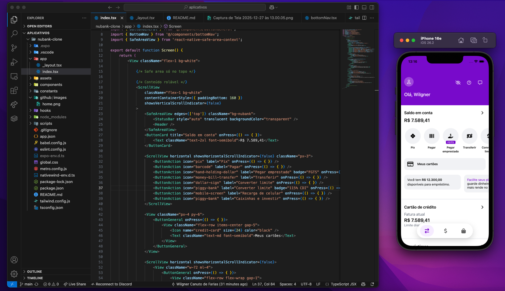

# 💜 Clone do Aplicativo Nubank

Este é um clone do aplicativo do **Nubank**, desenvolvido com **React Native** e **NativeWind**.  
O projeto foi criado com foco em **UI**, **componentização**, **boas práticas de layout mobile** e organização de código.

> ⚠️ Este projeto não possui qualquer vínculo com o Nubank. É apenas um estudo visual e técnico.

---

## 📱 Preview



---

## 🚀 Tecnologias utilizadas

- ⚛️ **React Native**
- 💨 **NativeWind (Tailwind para React Native)**
- 🎨 **Expo Vector Icons**
- 🧩 Componentização reutilizável
- 📱 Layout responsivo para mobile

---

## 🎯 Objetivo do projeto

- Praticar **React Native** na construção de interfaces reais
- Trabalhar **design system**, espaçamentos, cores e tipografia
- Aprimorar organização de componentes e reutilização
- Simular um app real para fins educacionais e portfólio

---

## 🛠️ Como rodar o projeto

### Pré-requisitos

- Node.js (versão 18 ou superior)
- npm ou yarn
- Expo CLI (opcional)
- Emulador Android/iOS ou app Expo Go

### 1️⃣ Clone o repositório
```bash
git clone https://github.com/Wilgner-Farias/clone-nubank-app.git
```
---
### 2️⃣ Entre na pasta do projeto
```bash
cd clone-nubank-app
```
---
### 3️⃣ Instale as dependências
```bash
npm install
# ou
yarn install
```
---
### 4️⃣ Inicie o servidor
```bash
npx expo start
```
---

## 🙋‍♂️ Autor
Projeto desenvolvido por **Wilgner Farias**

GitHub: https://github.com/Wilgner-Farias

LinkedIn: https://www.linkedin.com/in/wilgner-farias-963a72245/

## ©️ Créditos
- **Design:** Thalita Torres  
- **Projeto no Dribbble:** https://dribbble.com/shots/22305176-Nubank-Lending  

Este projeto foi implementado com base nesse design, apenas para fins educacionais.